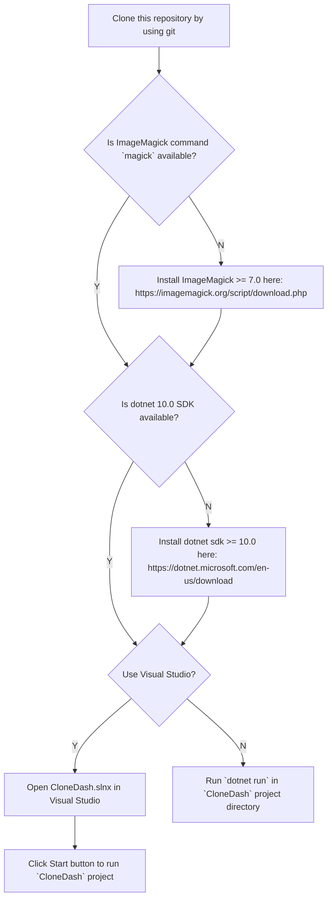

# CloneDash.DI

[CloneDash](https://github.com/marchc1/CloneDash) but uses [Dependency Injection](https://learn.microsoft.com/en-us/dotnet/core/extensions/dependency-injection/overview) design pattern.

## Status

We are diving into code. Use CloneDash if you just want to play.

## Comparations to CloneDash

### Compatibility

Nothing, but the name and features.

### Notable differences

- Use Dependency Injection design pattern

  Just an attempt to make development easier.

- Use [SDL3-CS](https://github.com/edwardgushchin/SDL3-CS) to handle everything about gui and multimedia stuffs.

  Fonts are handled by using `SDL_ttf` instead raylib. `SDL_ttf` supports fonts fallback feature.
  Hope we can use this feature instead writing code ourselves to get rid of tofus in CJK characters.

- Use [PathLib](https://github.com/nemec/pathlib) to unify path manipulation among different OSes.

  At least we get rid of building string and hope it is a valid path...

## License

The source code in this repository is licenced under `GPL-3.0-or-later` license:

```
An attempt to use Dependency Injection design pattern for CloneDash.

Copyright (C) 2026 CloneDash.DI Contributors

This program is free software: you can redistribute it and/or modify it under the terms of the GNU General Public License as published by the Free Software Foundation, either version 3 of the License, or (at your option) any later version.

This program is distributed in the hope that it will be useful, but WITHOUT ANY WARRANTY; without even the implied warranty of MERCHANTABILITY or FITNESS FOR A PARTICULAR PURPOSE. See the GNU General Public License for more details.

You should have received a copy of the GNU General Public License along with this program. If not, see <https://www.gnu.org/licenses/>.
```

## Development

<details>
<summary>
Follow this flowchart(Click to expand):
</summary>


</details>

### Properties

Sometimes those properties needs to be customized to fit your needs.
Pass `-p:<PropertyName>=<PropertyValue>` to dotnet CLI to customize them.

Here are the properties:

- `BundleNativeSdlLibs`: A boolean indicates if use bundled native SDL libraries.

  Defaults to `true`, set to `false` to use SDL from your system.

  Useful for Linux users, the prebuilt one does not contain Wayland support.
  You may also want to use system libraries when packaging on Linux.
